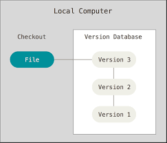
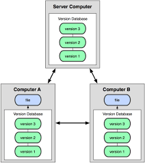

# Version Control Systems (VCSs)

## About version control

**Version control** - is a system that records changes to a file or set of files over time so that you can recall specific versions later (revert selected files back to a previous state)

### Local Version Control Systems

A simple database that kept all the changes to files under revision control

  

One of the most popular was a system called **RCS** - Works by keeping patch sets (differences between files)

### Centralized Version COntrol Systems (CVCSs)

The need to collaborate with developers on other systems, a single server that contains all the versioned files

  

The centralized server can be a single point of failure, if the server goes down no one can work, and if the hard disc becomes corrupted without backup you can lose all the project

### Distributed Version Control Systems (DVCSs)

Fully mirror the repository, including its full history, every clone is a full backup of all the data

  

### Three States

- Modified - Changed the file
- Staged - Marked a modified file in its current version
- Committed - data safely stored in your local database

